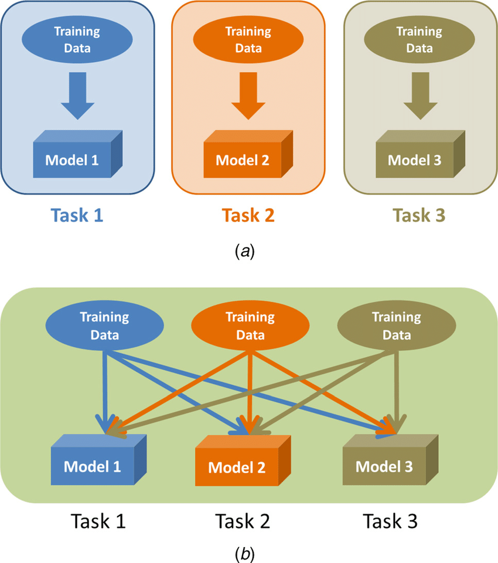
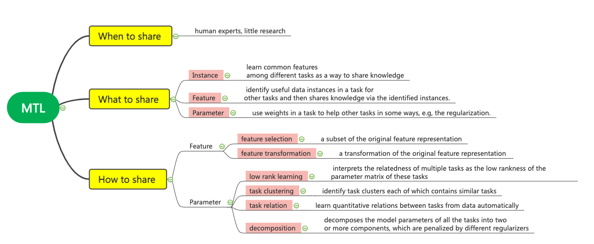
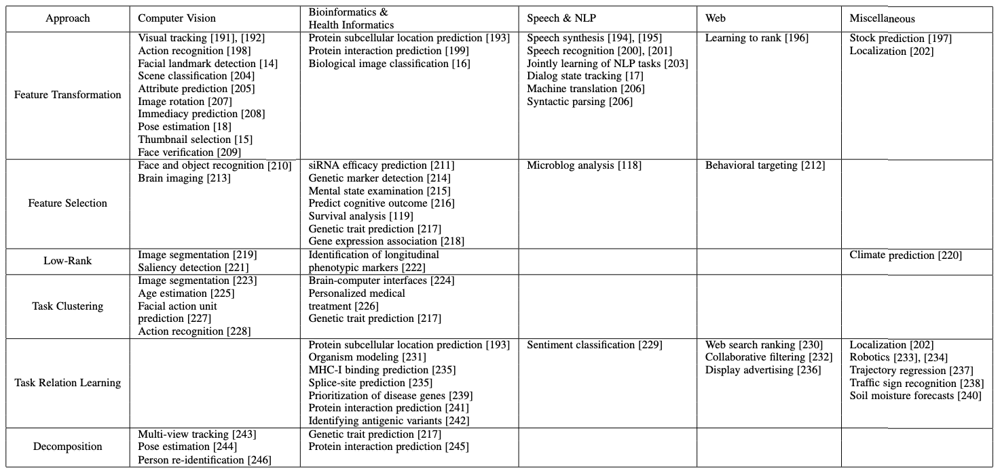
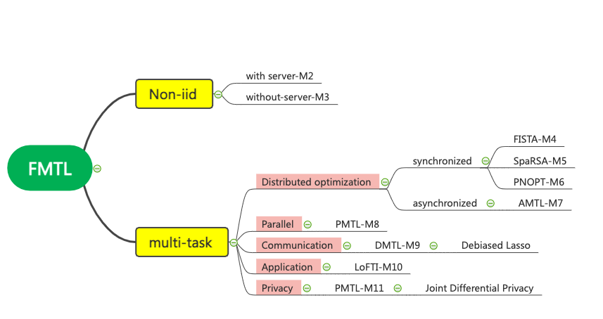
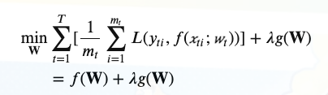

# Federated Multi-task Learning

Multi-task learning captures the similarity between tasks and obtains a task similarity graph. For federated learning, the task relationship graph can also be used as a communication graph. For a client, it communicates with clients that are highly related to its tasks when updating the model, so as to perform collaborative learning and reduce communication with unrelated clients. 

## Multi-task learning

[M1] [A Survey on Multi-Task Learning.](./Multitask/M1-A_Survey_on_Multi-Task_Learning.pdf) IEEE TKDE 2021.

This paper is a survey of Multi-task Learning. It summarizes the existing approaches as well as the MTL applications. It can be viewed as a knowledge-sharing learning process. The key problem of MTL is:

- when to share: human experts
- **what to share**: feature, instance, parameter
- **how to share**: 2+4 approaches 

There are MTL applications as the following table.

## Federated Multi-task learning

### Non-IID
In order to solve the problem that the data is not independent and identically distributed in federated learning, some papers [M2] [M3] proposed a training method that does not aim to train a global model, but each node can train a different model. This can be viewed as personalization.

[M2] [Federated multi-task learning]() NIPS 2017

There is a central server.

[M3] [Federated multi-task learning under a mixture of distributions]() NIPS 2021

There is no central server, so it is decentralized.

### Multi-task
multi-task, aims to optimize the prediction of individual model. The objective function in general is:

where the second part is the regularization and it encodes the task relation based on the multi-task assumption.

- distributed optimization:

[M4] [A fast iterative shrinkage-thresholding algorithm for linear inverse problems]()

synchronized

[M5] [Sparse reconstruction by separable approximation]()

synchronized

[M6] [Proximal newton-type methods for minimizing composite functions]()

synchronized

[M7] [Asynchronous Multi-Task Learning]()

Asynchronous. Both the server and the client will maintain a copy of current model in memory, and the copy between task nodes may be different.

- parallel MTL

[M8] [Parallel Multi-Task Learning]()

- communication efficiency

[M9] [Distributed multi-task learning]() AISTATS 2016

Debiased Lasso. estimation

- application

[M10] [Learning Context-aware Policies from Multiple Smart Homes via Federated Multi-Task Learning]() IoTDI 2020

- privacy

[M11] [Private Multi-Task Learning: Formulation and Applications to Federated Learning] ()

