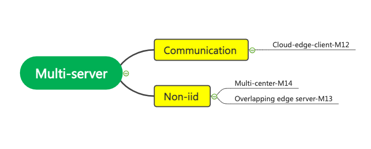
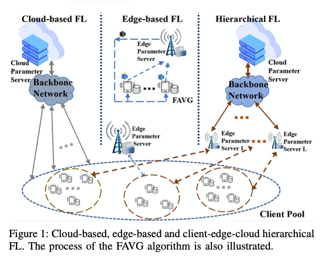
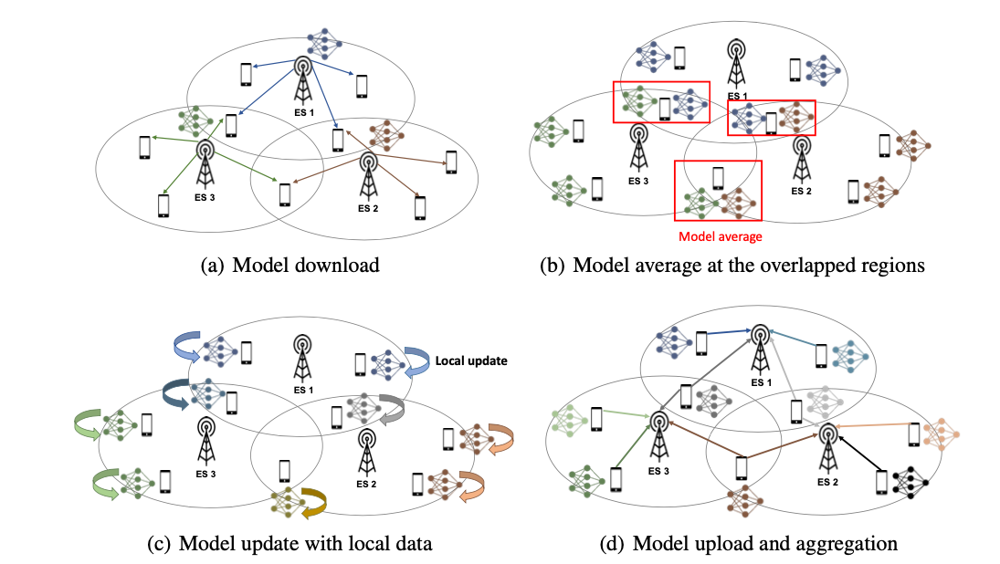
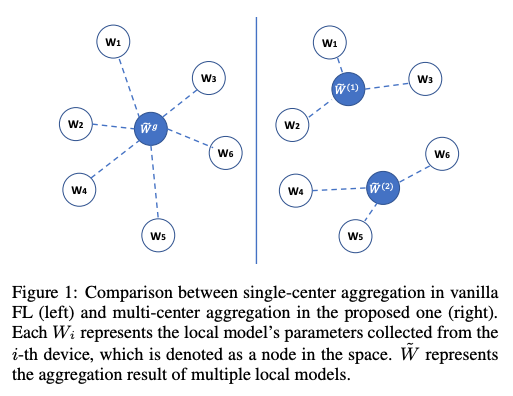

# Federated Multi-xxx Learning

Multi-task learning captures the similarity between tasks and obtains a task similarity graph. For federated learning, the task relationship graph can also be used as a communication graph. For a client, it communicates with clients that are highly related to its tasks when updating the model, so as to perform collaborative learning and reduce communication with unrelated clients. 

## Multi-task learning

[M1] [A Survey on Multi-Task Learning.](./Multitask/M1-A_Survey_on_Multi-Task_Learning.pdf) IEEE TKDE 2021.

This paper is a survey of Multi-task Learning. It summarizes the existing approaches as well as the MTL applications. It can be viewed as a knowledge-sharing learning process. The key problem of MTL is:

- when to share: human experts
- **what to share**: feature, instance, parameter
- **how to share**: 2+4 approaches 

There are MTL applications as the following table.

## Federated Multi-task learning

### Non-IID
In order to solve the problem that the data is not independent and identically distributed in federated learning, some papers [M2] [M3] proposed a training method that does not aim to train a global model, but each node can train a different model. This can be viewed as personalization.

[M2] [Federated multi-task learning]() NIPS 2017

There is a central server.

[M3] [Federated multi-task learning under a mixture of distributions](./Multitask/M3_Federated_Multi-Task_Learning_under_a_Mixture_of_Distributions.pdf) NIPS 2021

There is no central server, so it is decentralized.

- where: general FL
- what: FMTL that each local data is a mixture of unknown underlying distributions, 

### Multi-task
multi-task, aims to optimize the prediction of individual model. The objective function in general is:

where the second part is the regularization and it encodes the task relation based on the multi-task assumption.

- distributed optimization:

[M4] [A fast iterative shrinkage-thresholding algorithm for linear inverse problems]()

synchronized

[M5] [Sparse reconstruction by separable approximation]()

synchronized

[M6] [Proximal newton-type methods for minimizing composite functions]()

synchronized

[M7] [Asynchronous Multi-Task Learning]()

Asynchronous. Both the server and the client will maintain a copy of current model in memory, and the copy between task nodes may be different.

- parallel MTL

[M8] [Parallel Multi-Task Learning]()

- communication efficiency

[M9] [Distributed multi-task learning]() AISTATS 2016

Debiased Lasso. estimation

- application

[M10] [Learning Context-aware Policies from Multiple Smart Homes via Federated Multi-Task Learning]() IoTDI 2020

- privacy

[M11] [Private Multi-Task Learning: Formulation and Applications to Federated Learning] ()

#### Possible direction and conclusion
- If we go Non-iid, we should compare with M2 and especially M3
- Optimization is not a good direction since there have been a lot of works
- CMU group has also got stuck somewhere in this direction and go IoT now
- Possible direction: application, attack, fairness.

## Multi-federator learning
An FL system can consist of multiple server to organize the same or different tasks. For different task scenario, it is multi-task learning [M3]. For the same tasks, It can be viewed as personalization or a solution to specific problem.

[M12] [Client-Edge-Cloud Hierarchical Federated Learning]()

This paper proposes a client-edge-cloud hierarchical Feder- ated Learning system, supported with a HierFAVG algorithm that allows multiple edge servers to perform partial model aggregation. In this way, the model can be trained faster and better communication-computation trade-offs can be achieved.

[M13] [FEDMES: SPEEDING UP FEDERATED LEARNING WITH MULTIPLE EDGE SERVERS](./Multitask/M13-FEDMES- SPEEDING-UP-FEDERATED LEARNING-WITH MULTIPLE-EDGE-SERVERS.pdf)

The goal is for faster convergence especially under non-iid. The key idea is to utilize the devices located in the overlapping areas between the coverage of edge servers; in the model-downloading stage, the devices in the overlapping areas receive multiple models from different edge servers, take the average of the received models, and then update the model with their local data. These devices send their updated model to multiple edge servers by broadcasting, which acts as bridges for sharing the trained models between servers.

- what: speeding up convergence of multiple edge servers 
- where: cars and drones which need fast adaption 
- why: for latency-sensitive edge-based FL applications, there are an insufficient number of or biased clients within the coverage of an edge server for training a global model with enough accuracy.
- how:  clients located in the overlapping areas between the coverage of ESs receive multiple edge models and train and send back the models.
- paper: algorithm description, lactency analysis, convergence bound. 
- experiments: dataset=(mnist fashion cifar), L=3, K=90, S=60 (overlap/nonlap),

[M14] [Multi-center federated learning]()

It proposes a novel multi-center aggregation mechanism . It learns multiple global models from data, and simultaneously derives the optimal matching between users and centers. It is formulated as a bi-level optimization problem that can be efficiently solved by a stochastic expectation maximization (EM) algorithm. 

#### Possible direction and conclusion
- Soving Non-iid only is not a good choice
- Consider the cooperation of multiple servers, e.g.,

