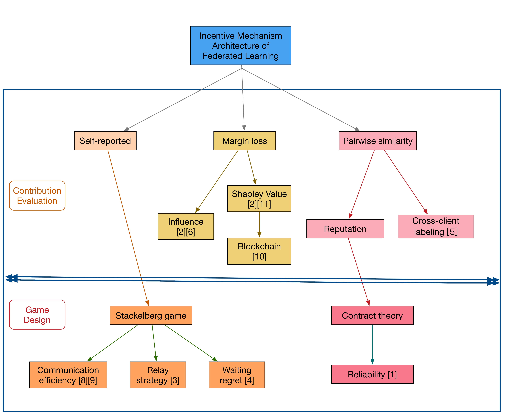

# Federated-Learning-Conferences-Journals
Conferences and Journals Collection for Federated Learning from 2019 to 2021. For jounals, the impact factors on year 2019 are provided. For conferences, the number of accepted papers are provided.

## Conferences
- A-Level

|  Conference   | 2019 | 2020 | 2021 |
|  ----  | ----  | ----  | ----  |
| AAAI  | - | 6 |  |
| IJCAI  | 1 | 2 |  | 
| AISTATS | - | 3 |   | 
| ICLR | - | 4 |   | 
| KDD | - | 2 |   | 
| INFOCOM | 2 |7  |   | 
| ICML | 3 |  6|   | 
| MOBICOM | - | 1 |   | 
| NeurIPS | - | 17 |   | 
| CCS |  1 |  |   | 
| RTSS | 1 |  |   | 
| S&P | 2 |  |   | 
| USENIX Security| - | 1 | |

- B-Level

|  Conference   | 2019 | 2020 | 2021 |
|  ----  | ----  | ----  | ----  |
| CIKM | 1 | 1 |   | 
| ICDM | - |  1|   | 
| COLING  | - | 1 |  |
| ICDCS  | 3 | - |  | 
| EMNLP | - | 2 |   | 
| ECAI | - | 2 |   | 
| DASFAA | - | 4 |   | 
| CoNEXT | - |5  |   | 
| ICNP | - |  2 |   | 
| ICPP | - | 2 |   | 
| ICSOC | - |  2 |   | 
| ICWS | 2 | 2 |   | 
| AIES | - | 1 |   | 
| IPDPS |  - | 2 |   | 
| MIDDLEWARE | - | 3 |   | 
| DCC | 1 | - |   | 
| MOBISYS | 1 |  |   | 
| WSDM | 1 |  |   | 
| NDSS | - | 3 |   | 

- C-Level

|  Conference   |
|  ----  | 
| CCGRID | 
| BIGDATA | 
| GlobalCom | 
| ICC | 
| ICASSP | 
| ICCCN | 
| ISCAS | 
| LCN | 
| NCA | 
| NETWORKING | 
| SMC | 
| WCNC | 
| AMIA | 
| ICIP | 
| IROS | 
| ICPADS | 
| MSN | 
| IJCNN | 

## Journals

|  Impact Factor > 5.0   | IF |
|  ----   | ----  |
|  Future Generation Computer Systems|5.6 |
|   IEEE Internet of Things|9.9 | 
|  Information Science|5.9 |
|  IEEE Journal on Selected Areas in Communications|11.4 |
|  Knowledge-Based Systems|5.9 |
|  IEEE Transactions on Information Forensics and Security|6.0 |
|  IEEE Transactions on Industrial Informatics|9.1 |
|  IEEE Transactions on Signal Processing|5.0 |
|  IEEE Transactions on Wireless Communications|6.8 |
|  Communications of the ACM|7.0 |
|  IEEE Communications Magazine|11.1 |
|  IEEE Network|8.8 |
|  IEEE Transactions on Neural Networks and Learning Systems|8.8 |
|  IEEE Transactions on Vehicular Technology|5.4 |

| Others | 
| --- |
| IEEE Access|
| IEEE COMMUNICATIONS LETTERS|
| Journal of Parallel and Distributed Computing|
| Journal of Software|
| IEEE Open Journal of the Communications Society|
|  Sensors|
| IEEE Transactions on Knowledge and Data Engineering|
|  Computer Networks |
| IEEE Intelligent Systems|
| Computers & Security|
|  Mobile Networks and Applications|

## Conference Hot Topics

|  Conference   | 2019 | 2020 | 2021 |
|  ----  | ----  | ----  | ----  |
| AAAI  | - | Optimization, NLP, Representation, CV, Privacy, Robustness |  |
| IJCAI  | Explanation | Incentive, Meta-Learning |  | 
| AISTATS | - | Privacy, Efficiency, Robustness |   | 
| ICLR | - | Aggregation, Robustness, Optimization |   | 
| KDD | - | Optimization, NLP |   | 
| INFOCOM | Privacy, Edge | Robustness,  Distribution, Edge, Optimization, Security |   | 
| ICML | Aggregation, Optimization, Robustness|  Distribution, Efficiency, Optimization |   | 
| MOBICOM | - | Efficiency, Privacy |   | 
| NeurIPS | - | Robustness, Optimization, Efficiency, Aggregation,  Personalization, Meta-Learning,  Split Learning|   | 
| CCS |  Security |  |   | 
| RTSS | Edge |  |   | 
| S&P | Privacy, Robustness|  |   | 
| NDSS | - |  Privacy, Robustness |   | 
| USENIX Security| - | Robustness | |

## Famous Groups

|  Group   | Topic1 | Topic2 | Topic3 |
|  ----  | ----  | ----  | ----  |
| Qiang Yang | Distribution | Incentive | CV/NLP| 
| Vitaly Shmatikov | Robustness | Personalization |   | 
| Salman Avestimehr | Edge| Robustness | Aggregation |
| Bingsheng He| Privacy | Meta-Learning  |   | 
| Peter Richtárik |  Optimization | Personalization |  Efficiency | 
| Virginia Smith | Optimization | Distribution | Multi-Task | 
| Heng Huang | Optimization |  |   | 
|Choong Seon Hong | Edge| 
| H. Vincent Poor | Wireless| Security| Edge|
| Martin Jaggi| Optimization | Robustness|
| Nguyen H. Tran | Optimization| Personalization| Edge|
| Mehrdad Mahdavi | Optimization| Personalization| Efficiency| 
| Ananda Theertha Suresh | Optimization | Personalization | NLP  | 
| Yasaman Khazaeni | Aggregation | Personalization | NLP | 
| Seraphin B. Calo | Robustness | |   | 

## Related Works
### Incentives
[incentive works](./incentive.md)

### Robustness
[poison works](./poison.md)

### Optimization_Distribution
[optimization and distribution works](./optimization_distribution.md)

