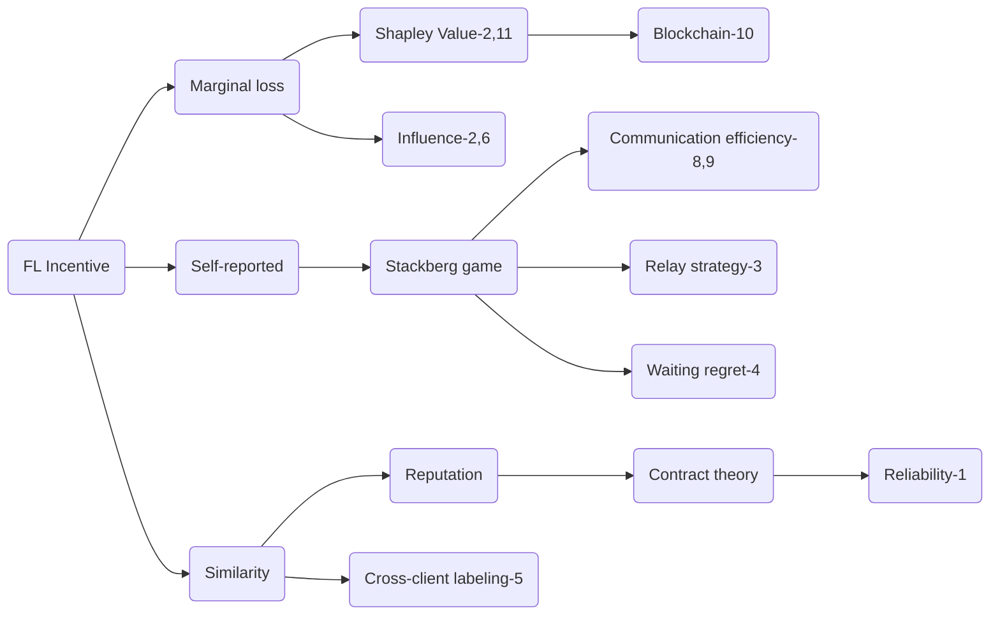
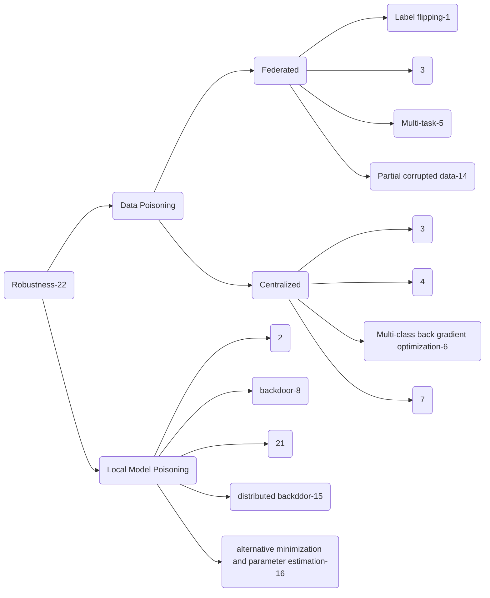
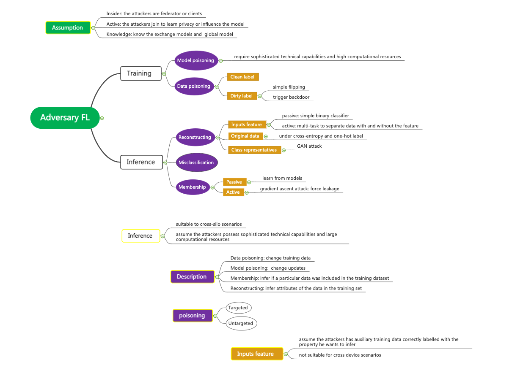
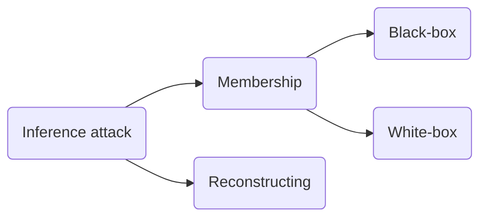
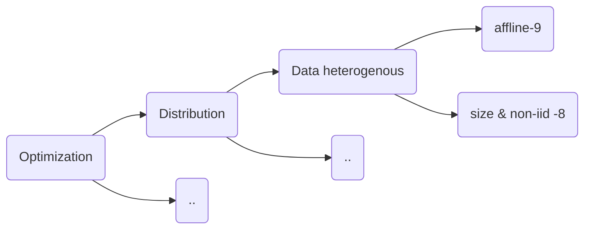

# Federated-Learning-Conferences-Journals
Conferences and Journals Collection for Federated Learning from 2019 to 2021. For jounals, the impact factors on year 2019 are provided. For conferences, the number of accepted papers are provided.

## Conferences
- A-Level

|  Conference   | 2019 | 2020 | 2021 |
|  ----  | ----  | ----  | ----  |
| AAAI  | - | 6 |  |
| IJCAI  | 1 | 2 |  | 
| AISTATS | - | 3 |   | 
| ICLR | - | 4 |   | 
| KDD | - | 2 |   | 
| INFOCOM | 2 |7  |   | 
| ICML | 3 |  6|   | 
| MOBICOM | - | 1 |   | 
| NeurIPS | - | 17 |   | 
| CCS |  1 |  |   | 
| RTSS | 1 |  |   | 
| S&P | 2 |  |   | 

- B-Level

|  Conference   | 2019 | 2020 | 2021 |
|  ----  | ----  | ----  | ----  |
| CIKM | 1 | 1 |   | 
| ICDM | - |  1|   | 
| COLING  | - | 1 |  |
| ICDCS  | 3 | - |  | 
| EMNLP | - | 2 |   | 
| ECAI | - | 2 |   | 
| DASFAA | - | 4 |   | 
| CoNEXT | - |5  |   | 
| ICNP | - |  2 |   | 
| ICPP | - | 2 |   | 
| ICSOC | - |  2 |   | 
| ICWS | 2 | 2 |   | 
| AIES | - | 1 |   | 
| IPDPS |  - | 2 |   | 
| MIDDLEWARE | - | 3 |   | 
| DCC | 1 | - |   | 
| MOBISYS | 1 |  |   | 
| WSDM | 1 |  |   | 
| NDSS | - | 3 |   | 

- C-Level
	- CCGRID
	- BIGDATA
	- GlobalCom
	- ICC
	- ICASSP
	- ICCCN
	- ISCAS
	- LCN
	- NCA
	- NETWORKING
	- SMC
	- WCNC
	- AMIA
	- ICIP
	- IROS
	- ICPADS
	- MSN
	- IJCNN

## Journals

- Impact Factor > 5.0
	- Future Generation Computer Systems-5.6
	- IEEE Internet of Things-9.9
	- Information Science-5.9
	- IEEE Journal on Selected Areas in Communications-11.4
	- Knowledge-Based Systems-5.9
	- IEEE Transactions on Information Forensics and Security-6.0
	- IEEE Transactions on Industrial Informatics-9.1
	- IEEE Transactions on Signal Processing-5.0
	- IEEE Transactions on Wireless Communications-6.8
	- Communications of the ACM-7.0
	- IEEE Communications Magazine-11.1
	- IEEE Network-8.8
	- IEEE Transactions on Neural Networks and Learning Systems-8.8
	- IEEE Transactions on Vehicular Technology-5.4

- Others
	- IEEE Access
	- IEEE COMMUNICATIONS LETTERS
	- Journal of Parallel and Distributed Computing
	- Journal of Software
	- IEEE Open Journal of the Communications Society
	- Sensors
	- IEEE Transactions on Knowledge and Data Engineering
	- Computer Networks 
	- IEEE Intelligent Systems
	- Computers & Security
	- Mobile Networks and Applications

## Conference Hot Topics

|  Conference   | 2019 | 2020 | 2021 |
|  ----  | ----  | ----  | ----  |
| AAAI  | - | Optimization, NLP, Representation, CV, Privacy, Robustness |  |
| IJCAI  | Explanation | Incentive, Meta-Learning |  | 
| AISTATS | - | Privacy, Efficiency, Robustness |   | 
| ICLR | - | Aggregation, Robustness, Optimization |   | 
| KDD | - | Optimization, NLP |   | 
| INFOCOM | Privacy, Edge | Robustness,  Distribution, Edge, Optimization, Security |   | 
| ICML | Aggregation, Optimization, Robustness|  Distribution, Efficiency, Optimization |   | 
| MOBICOM | - | Efficiency, Privacy |   | 
| NeurIPS | - | Robustness, Optimization, Efficiency, Aggregation,  Personalization, Meta-Learning,  Split Learning|   | 
| CCS |  Security |  |   | 
| RTSS | Edge |  |   | 
| S&P | Privacy, Robustness|  |   | 
| NDSS | - |  Privacy, Robustness |   | 

## Famous Groups

|  Group   | Topic1 | Topic2 | Topic3 |
|  ----  | ----  | ----  | ----  |
| Qiang Yang | Distribution | Incentive | CV/NLP| 
| Vitaly Shmatikov | Robustness | Personalization |   | 
| Salman Avestimehr | Edge| Robustness | Aggregation |
| Bingsheng He| Privacy | Meta-Learning  |   | 
| Peter Richtárik |  Optimization | Personalization |  Efficiency | 
| Virginia Smith | Optimization | Distribution | Multi-Task | 
| Heng Huang | Optimization |  |   | 
|Choong Seon Hong | Edge| 
| H. Vincent Poor | Wireless| Security| Edge|
| Martin Jaggi| Optimization | Robustness|
| Nguyen H. Tran | Optimization| Personalization| Edge|
| Mehrdad Mahdavi | Optimization| Personalization| Efficiency| 
| Ananda Theertha Suresh | Optimization | Personalization | NLP  | 
| Yasaman Khazaeni | Aggregation | Personalization | NLP | 
| Seraphin B. Calo | Robustness | |   | 

## Related Works
### Incentives

[IN1] [Incentive Mechanism for Reliable Federated Learning: A Joint Optimization Approach to Combining Reputation and Contract Theory](./Incentives/1-Incentive-Mechanism-for-Reliable-Federated-Learning—A-Joint-Optimization-Approach-to-Combining-Reputation-and-Contract-Theory.pdf)

This paper addresses the challenges of incentive mechanisms
for participating in training and worker selection schemes for reliable federated learning.it introduce reputation as the metric to
measure the reliability and trustworthiness of the mobile devices. The reputation measurement is multi-weight subjective logic model. This paper also leverage the blockchain to achieve secure reputation management for workers with non-repudiation and tamper-resistance properties in a decentralized manner.

[IN2] [Measure Contribution of Participants in Federated
Learning](./Incentives/2-Measure-Contribution-of-Participants-in-Federated-Learning.pdf)

This study focuses on measuring contribution of each client in federated learning, using margin loss. Specifically, For
Horizontal FML it uses deletion method to calculate the grouped instance influence. For Vertical FML it use Shapley Values to
calculate the grouped feature importance. this methods open the door for research in model contribution and credit allocation in the context of federated learning.

[IN3] [Joint Service Pricing and Cooperative Relay Communication for Federated Learning](./Incentives/3-Joint-Service-Pricing-and-Cooperative-Relay-Communication-for-Federated-Learning.pdf)

In many scenarios, the direct communication may be unavailable because of limited transmission range and energy inefficiency because of high transmission power. The main focus of this paper is incentive for communication in federated learning by adopting the relay network to construct a cooperative communication platform for supporting model update transfer and trading. However, under the cooperative relay network design, the
larger size of training data implies the lower probability of enjoying the relay service. As a result, the learning service pricing and cooperative relaying should be considered jointly. In detail, clients price their learning service by deciding on the price of one unit of their training data. In return, the server determines the size of training data for each client.

[IN4] [A Fairness-aware Incentive Scheme for Federated Learning](./Incentives/4-A-Fairness-aware-Incentive-Scheme-for-Federated-Learning.pdf)

This paper studies the payoff-sharing scheme on costs and temporary mismatch between contributions and rewards of FL, focusing on "fairness". Their proposed scheme FLI maximizes the overall effectiveness of the data alliance, and at the same time minimizes the imbalance of "regret" and waiting time between participants.

[IN5] [Towards Fair and Privacy-Preserving Federated
Deep Models](./Incentives/5-Towards-Fair-and-Privacy-Preserving-Federated-Deep-Models.pdf)

This work(FPPDL) designs a local credibility mutual
evaluation mechanism to guarantee fairness, and a three-layer onion-style encryption scheme to guarantee both accuracy and privacy. under FPPDL, each participant receives a different version of the FL model with performance commensurate with his contributions. Unlike existing works which use monetary rewards to incentivize good behaviour, this solution fundamentally changes the current FL paradigm so that participants may not receive the same FL model in the end.

[IN6] [Rewarding High-Quality Data via Influence for Linear Regression](./Incentives/6-Rewarding-High-Quality-Data-via-Influence-for-Linear-Regression.pdf)

This paper shows how a payment structure can be designed to incentivize the agents to provide high-quality data as early as possible for linear regression models in crowdsourcing scenario such as federated learning. It is based on a characterization of the influence that data points have on the loss function of the model. However, this contribution has its limits on network versatility since it only focus on linear regression.

[IN7] [DeepChain: Auditable and Privacy-Preserving Deep Learning with Blockchain-based Incentive](./Incentives/7-DeepChain-Auditable-and-Privacy-Preserving-Deep-Learning-with-Blockchain-based-Incentive.pdf)

Weng et al. proposes
DeepChain, which is a decentralized framework relies on
blockchain-based incentive mechanism and cryptographic primitives
for privacy-preserving distributed deep learning. DeepChain can securely aggregate local intermediate gradients from untrusted parties through launching transactions, while local training and parameter updating are performed by workers who are incented to process the transactions. To further
enable deep learning on encrypted data, homomorphic encryption
is leveraged in DeepChain.

[IN8] [Federated Learning for Edge Networks: Resource Optimization and Incentive Mechanism](./Incentives/8-Federated-Learning-for-Edge-Networks-Resource-Optimization-and-Incentive-Mechanism.pdf)

This paper provides a primary design aspects for edge Federated Learning with IoT, by Stackelberg game with resource optimization. The utility of clients focus on the number of local iterations, essentially, local computation power. On the other hand, the server aims at maximizing its utility such as the number of communication rounds needed to reach a desirable global accuracy. However, there is not any detailed utility function in this work. This paper also presents chanllenges for Federated Learning on edge including Resource Optimization for Blockchain based Federated Learning, Context-Aware and Mobility-Aware Federated Learning.

[IN9] [A Crowdsourcing Framework for On-Device Federated Learning](./Incentives/9-A-Crowdsourcing-Framework-for-On-Device-Federated-Learning.pdf)

This work handles the communication efficiency of clients implementing an uncoordinated computation strategy while model aggregation. Specifically, it models two-stage Stackelberg game by establishing a communication-efficient cost model for clients and reward rate for the server. Additionally, it formalizes an admission control scheme for participating clients to ensure a level of local accuracy.

[IN10] [FedCoin: A Peer-to-Peer Payment System for Federated Learning](./Incentives/10-FedCoin-A-Peer-to-Peer-Payment-System-for-Federated-Learning.pdf)

Shaply Value (SV) is often adopted in contribution assessment of Federated Learning. However, calculating SV is time-consuming and costly. This paper proposes FedCoin, a peer-to-peer payment system based on blockchain, which uses the Proof of Shapley consensus protocol to generate new blocks. The consensus generates new blocks by calculating the SV value instead of the meaningless hash in Bitcoin.

[IN11] [Profit Allocation for Federated Learning](./Incentives/11-Profit-Allocation-for-Federated-Learning.pdf)

This paper also values the feasibility of Shapley Value on federated contribution measurement. However, facing the same challenging of high cost while demonstrating Shapley Value, this paper proposes the contribution index (CI), a new Shapley value based metric fit for assessing the contribution. The idea CI is to reconstruct the approximate models on different combinations of the datasets through the intermediate results during the training process so as to avoid extra training.

[IN12] [Understanding Federated Learning via Client-Level Influence Measurement.](./Incentives/12-Understanding_Federated_Learning_via_Client-Level_Influence_Measurement.pdf)

This paper proposes Fed-Influence, to measure contribution based on sub-model parameter without retrainig as well as a estimation algorithm. It works well on both convex and non-convex loss functions and does not require the  nal model to be optimal.

[IN15]
[A_Multi-player_Game_for_Studying_Federated_Learning](./Incentives/IN15_A_Multi-player_Game_for_Studying_Federated_Learnin.pdf)

IJCAI: Multi-party Game Demonstration

[IN16]
[An-incentive-scheme-for-federated-learning-in-the-sky](./Incentives/IN16-An-incentive-scheme-for-federated-learning-in-the-sky.pdf)

 Mobicom: Unmanned aerial vehicle

#### Improvements for Shapley Value

[S1] [Explaining prediction models and individual predictions with feature contributions.](https://link.springer.com/article/10.1007/s10115-013-0679-x)

In order to save the exponential calculation of Shapley Value, This paper apply Monte Carlo sampling to get the approximation of Shapley Value by averaging marginal contribution with random order generation under probability.

[S2] [Polynomial calculation of the Shapley value based on sampling.](./Incentives/Polynomial_calculation_of_the_Shapley_value.pdf)

This paper approximates shapley value estimation at in polynomial time. Specifically, it is by their proposed sampling strategy of drawing a representative group of individuals or cases from a particular population. It is also appliable for any semivalue estimation.

[S3] [Bounding the estimation error of sampling-based Shapley value approximation.](./Incentives/Bounding_the_Estimation_Error.pdf)

Based on the hardness and typical tackling of SV calculation, this paper focus on the classical characteristic function representation, the only attempt to approximate SV for the general class of games which is asymptotic. They propose non-asymptotic bounds on the estimation error under the condition that the variance and range of the players’ marginal contributions is known.

[S4] [Efficient computation of the Shapley value for game-theoretic network centrality.](./Incentives/Efficient_Computation_of_the_Shapley_Value.pdf)

Monte Carlo simulations for SV are computationally expensive and not guaranteed to give an exact answer. Thus, this paper develops exact analytical formulae for SV-based centrality in both weighted and unweighted networks and develop efficient (polynomial) algorithms based on them. Targeted networks include social, organisational, biological and communication networks.

[S5] [Explaining individual predictions when features are dependent: More accurate approximations to Shapley values.](./Incentives/Explaining_individual_predictions_when_features.pdf)

Kernel SHAP is a computationally efficient approximation to Shapley values in higher dimensions which assumes the features are independent. Therefore, this paper extend the Kernel SHAP to handle dependent features by clustering SV corresponding to dependent features, improving the presentation of feature contribution for individual predictions.

### Robustness

[P1] [Data Poisoning Attacks Against
Federated Learning Systems.](./Poison/P1_Data_Poisoning_Attacks_Against_Federated_Learning_Systems.pdf)

This paper studies targeted data poisoning attacks against FL systems in which a malicious subset of the participants aim to poison the
global model by sending model updates derived from mislabeled data.

[P2] [Local Model Poisoning Attacks to Byzantine-Robust Federated Learning.](./Poison/P2_Local_Model_Poisoning_Attacks_to_Byzantine_Robust_Federated_Learning.pdf)

It performs the first systematic study on local model poisoning attacks to federated learning under Byzantine-Robust FL. This paper formulates their attacks as optimization problems and apply our attacks to four recent Byzantine-robust federated learning methods.

[P3] [Learning to Detect Malicious Clients for Robust Federated Learning.](./Poison/P3_Learning_to_Detect_Malicious_Clients_for_Robust_Federated_Learning.pdf)

As the central server in the system cannot govern the behaviors of the clients, a rogue client may initiate an attack by sending malicious model updates to the server, so as to degrade the learning performance or enforce targeted model poisoning attacks (a.k.a. backdoor attacks). Therefore, timely detecting these malicious model updates and the underlying attackers becomes critically important. This work proposes a new framework for robust federated learning where the central server learns to detect and remove the malicious model updates using a powerful detection model, leading to targeted defense. 

[P4] [Targeted Backdoor Attacks on Deep Learning Systems Using Data Poisoning.](./Poison/P4_Targeted_Backdoor_Attacks_on_Deep_Learning_Systems_Using_Data_Poisoning.pdf)

It focus on backdoor data poisoning. In this paper, their studied poisoning strategies can apply under a very weak threat model: (1) the adversary has no knowledge of the model and the training set used by the victim system; (2) the attacker is allowed to inject only a small amount of poisoning samples; (3) the backdoor key is hard to notice even by human beings to achieve stealthiness. 

[P5] [Data Poisoning Attacks on Federated Machine
Learning.](./Poison/P5_Data_Poisoning_Attacks_on_Federated_Machine_Learning.pdf)

This paper focus on attacking a federated multi-task learning framework. They formulate the problem of computing optimal poisoning attacks on federated multi-task learning as a bilevel program that is adaptive to arbitrary choice of target nodes and source attacking nodes. Then it propose a systems-aware optimization method, ATTack, which is efficiency to derive the implicit gradients for poisoned data, and further compute optimal attack strategies in the federated machine learning. 

[P6] [Towards Poisoning of Deep Learning Algorithms with
Back-gradient Optimization.](./Poison/P6_Towards_Poisoning_of_Deep_Learning_Algorithms_with_Back-gradient_Optimization.pdf)

To date, data poisoning attacks have been devised only against a limited class of binary learning algorithms, due to the inherent complexity of the gradient-based procedure used to optimize the poisoning points (a.k.a. adversarial training examples). This work extend the definition of poisoning attacks to multiclass problems and propose a poisoning algorithm based on the idea of back-gradient optimization, i.e., to compute the gradient of interest through automatic differentiation, while also reversing the learning procedure to drastically reduce the attack complexity.

[P7] [A Flexible Poisoning Attack Against Machine
Learning.](./Poison/P7_A_Flexible_Poisoning_Attack_Against_Machine_Learning.pdf)

This article proposes an attack method in which the attacker makes the parameter value of the learning model close to his expected value and at the same time makes the model output wrong predictions for certain test samples. It considers the effect of attack and the concealment of attack. 

[P8] [How To Backdoor Federated Learning](./Poison/P8_How_To_Backdoor_Federated_Learning.pdf)

The paper proposes an input matrix manipulation to conduct targeted local model poisoning backdoor in federated learning. When the global is about to converge, the attacker could inject a malicious model based on the difference of the clean global one. And it proved to be efficient even when the attacker does not know the global learning rate. 

[P14] [Robust Federated Training via Collaborative Machine Teaching using Trusted Instances](./Poison/P14_Robust_Federated_Training_via_Collaborative_Machine_Teaching_using_Trusted_Instances.pdf)
AAAI

This paper considers partial corrupted local data while the rest fraction is trusted in FL. The clients are organized to jointly tune the corrupted training data set, such that the model learnt with the tuned training set by the server predicts consistent targets as the trusted instances. More specifically, we adopt two types of training data tuning operations: crafting the training instances and subset-selecting the training set.

[P15]
[dba distributed backdoor attacks against federated learning](./Poison/P15_dba_distributed_backdoor_attacks_against_federated_learning.pdf)
ICLR

Instead of applying the same trigger in the attackers' datasets in [P8], this paper studies the distributed triggers (multiple triggers for subtasks) in FL, which can be more insidious and hard to detect. Additionally, the impact of triggers factors (eg. size, gap, location) are studied.

[P16]
[Analyzing_Federated_Learning_through_an_Adversarial_Lens](./Poison/P16_Analyzing_Federated_Learning_through_an_Adversarial_Lens.pdf)
ICML

1. FedAvg, boost the malicious agent’s update to overcome the effects of other agents’ updates by K times with E=5;
2. propose an alternating minimization strategy, which alternately optimizes for the stealth objectives and the adversarial objective; 
3. using parameter estimation for the benign agents’ updates to improve on attack success by averaging methods assuming the cumulative updates were the same at each step for benigns;  
4. use a suite of interpretability techniques to generate visual explanations for both benign and malicious models to demonstrate indistinguishability.

[P17]

[P18]
[attack-of-the-tails-yes-you-really-can-backdoor-federated-learning-Paper](./Poison/P18-attack-of-the-tails-yes-you-really-can-backdoor-federated-learning-Paper.pdf)
NIPS

This paper concludes that FL systems can NOT be tailored to be robust against backdoors. And it provides edge-case backdoors which forces a model to misclassify on seemingly easy inputs that are however unlikely to be part of the training, or test data, i.e., they live on the tail of the input distribution.

[P19]
[Comprehensive-Privacy-Analysis-of-Deep-Learning-Passive-and-Active-White-box-Inference-Attacks-against-Centralized-and-Federated-Learning](./Poison/P19_Comprehensive-Privacy-Analysis-of-Deep-Learning-Passive-and-Active-White-box-Inference-Attacks-against-Centralized-and-Federated-Learning.pdf)
S&P

This paper proposes a white-box membership inference attacks, one observation from this paper is that latter layer leaks more information than the former, however the leakage of activation layer is similar to output layer. So the results of white-box and black-box using activation information are similar. It design deep learning attack models using the gradient vector over all parameters on the target data point as the main feature for the attack. The architecture (simple CNN + FCN) processes extracted (gradient) features from different layers of the target model separately, and combines their information to compute the membership probability of a target data point.  Further， it designs an active attack in the federated learning setting, the adversary can actively push SGD to leak even more information about the participants’ data. 

[P20] [FLTrust: Byzantine-robust Federated Learning via Trust Bootstrapping
](./Poison/P20-FLTrust-Byzantine-robust-Federated-Learning-via-Trust-Bootstrapping.pdf)
NDSS

Rather than performing anomaly detection in local model, this paper build bootstraping trust by compute the cosine similarity beteween server updates and clients' updates, which is named as trust score. The weighted aggregation is based on trust scores and updates normalized by the magnitude of server updates.

[P21] [Manipulating the Byzantine: Optimizing Model Poisoning Attacks and Defenses for Federated Learning
](./Poison/P21-Manipulating-the-Byzantine-Optimizing-Model-Poisoning-Attacks-and-Defenses-for-Federated-Learning.pdf)
NDSS

This paper presents a generic framework for model poisoning attacks and a novel defense   called divide-and-conquer (DnC) on FL. The key idea of its generic poisoning is that they introduce perturbation vectors and optimize the scaling factor $\gamma$ in both AGR-tailored and AGR-agnostic manners. DnC applies a singular value decomposition (SVD) based spectral methods to detect and remove outliers.

[P22] [Threats to Federated Learning: A Survey](./Poison/P22_Threats-to-Federated-Learning-A-Survey.pdf)

[P23] [Exploiting Unintended Feature Leakage in Collaborative Learning](./poison/P23-Exploiting-Unintended-Feature-Leakage-in-Collaborative-Learning.pdf)

### Optimization_Distribution

[A8] [Self-Balancing Federated Learning With Global Imbalanced Data in Mobile Systems](./Optimization_Distribution/A8-Self-Balancing-Federated-Learning-With-Global-Imbalanced-Data-in-Mobile-Systems.pdf)

The Astraea framework counterweighs the training of FL with imbalanced datasets by two strategies. First, before training the model, Astraea performs data augmentation to alleviate global imbalance. Second, Astraea proposes to use some mediators to reschedule the training of clients according to the KLD between the mediators and the uniform distribution.

[A9]
[robust-federated-learning-the-case-of-affine-distribution-shifts-Paper](./Optimization_Distribution/A9-robust-federated-learning-the-case-of-affine-distribution-shifts-Paper.pdf)
NIPS

This paper achieves satisfactory performance against distribution shifts in users’ samples (considering a structured affine distribution shift). To address this problem, they propose FLRA framework with a fast and efficient optimization method and provide convergence and performance guarantees via a gradient Descent Ascent (GDA) method. They further prove generalization error bounds for the learnt classifier to show proper generalization from empirical distribution of samples to the true underlying distribution.

[ST1] [Client Selection for Federated Learning with
Heterogeneous Resources in Mobile Edge](./Optimization_Distribution/St1_Client_Selection_for_Federated_Learning_with_Heterogeneous_Resources_in_Mobile_Edge.pdf)

This paper propose a client selection strategy suitable for heterogeneous nodes in distributed systems. It gives a submission deadline in federated learning in order to reduce the impact of staggers. The deadline has been choosen by experience.

