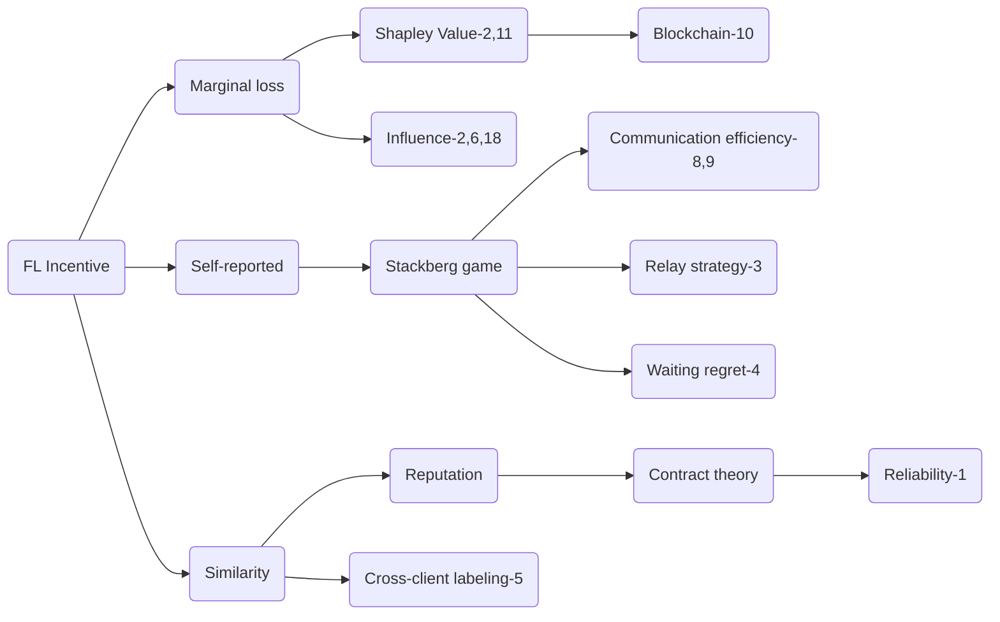

[IN1] [Incentive Mechanism for Reliable Federated Learning: A Joint Optimization Approach to Combining Reputation and Contract Theory](./Incentives/1-Incentive-Mechanism-for-Reliable-Federated-Learning—A-Joint-Optimization-Approach-to-Combining-Reputation-and-Contract-Theory.pdf)

This paper addresses the challenges of incentive mechanisms
for participating in training and worker selection schemes for reliable federated learning.it introduce reputation as the metric to
measure the reliability and trustworthiness of the mobile devices. The reputation measurement is multi-weight subjective logic model. This paper also leverage the blockchain to achieve secure reputation management for workers with non-repudiation and tamper-resistance properties in a decentralized manner.

[IN2] [Measure Contribution of Participants in Federated
Learning](./Incentives/2-Measure-Contribution-of-Participants-in-Federated-Learning.pdf)

This study focuses on measuring contribution of each client in federated learning, using margin loss. Specifically, For
Horizontal FML it uses deletion method to calculate the grouped instance influence. For Vertical FML it use Shapley Values to
calculate the grouped feature importance. this methods open the door for research in model contribution and credit allocation in the context of federated learning.

[IN3] [Joint Service Pricing and Cooperative Relay Communication for Federated Learning](./Incentives/3-Joint-Service-Pricing-and-Cooperative-Relay-Communication-for-Federated-Learning.pdf)

In many scenarios, the direct communication may be unavailable because of limited transmission range and energy inefficiency because of high transmission power. The main focus of this paper is incentive for communication in federated learning by adopting the relay network to construct a cooperative communication platform for supporting model update transfer and trading. However, under the cooperative relay network design, the
larger size of training data implies the lower probability of enjoying the relay service. As a result, the learning service pricing and cooperative relaying should be considered jointly. In detail, clients price their learning service by deciding on the price of one unit of their training data. In return, the server determines the size of training data for each client.

[IN4] [A Fairness-aware Incentive Scheme for Federated Learning](./Incentives/4-A-Fairness-aware-Incentive-Scheme-for-Federated-Learning.pdf)

This paper studies the payoff-sharing scheme on costs and temporary mismatch between contributions and rewards of FL, focusing on "fairness". Their proposed scheme FLI maximizes the overall effectiveness of the data alliance, and at the same time minimizes the imbalance of "regret" and waiting time between participants.

[IN5] [Towards Fair and Privacy-Preserving Federated
Deep Models](./Incentives/5-Towards-Fair-and-Privacy-Preserving-Federated-Deep-Models.pdf)

This work(FPPDL) designs a local credibility mutual
evaluation mechanism to guarantee fairness, and a three-layer onion-style encryption scheme to guarantee both accuracy and privacy. under FPPDL, each participant receives a different version of the FL model with performance commensurate with his contributions. Unlike existing works which use monetary rewards to incentivize good behaviour, this solution fundamentally changes the current FL paradigm so that participants may not receive the same FL model in the end.

[IN6] [Rewarding High-Quality Data via Influence for Linear Regression](./Incentives/6-Rewarding-High-Quality-Data-via-Influence-for-Linear-Regression.pdf)

This paper shows how a payment structure can be designed to incentivize the agents to provide high-quality data as early as possible for linear regression models in crowdsourcing scenario such as federated learning. It is based on a characterization of the influence that data points have on the loss function of the model. However, this contribution has its limits on network versatility since it only focus on linear regression.

[IN7] [DeepChain: Auditable and Privacy-Preserving Deep Learning with Blockchain-based Incentive](./Incentives/7-DeepChain-Auditable-and-Privacy-Preserving-Deep-Learning-with-Blockchain-based-Incentive.pdf)

Weng et al. proposes
DeepChain, which is a decentralized framework relies on
blockchain-based incentive mechanism and cryptographic primitives
for privacy-preserving distributed deep learning. DeepChain can securely aggregate local intermediate gradients from untrusted parties through launching transactions, while local training and parameter updating are performed by workers who are incented to process the transactions. To further
enable deep learning on encrypted data, homomorphic encryption
is leveraged in DeepChain.

[IN8] [Federated Learning for Edge Networks: Resource Optimization and Incentive Mechanism](./Incentives/8-Federated-Learning-for-Edge-Networks-Resource-Optimization-and-Incentive-Mechanism.pdf)

This paper provides a primary design aspects for edge Federated Learning with IoT, by Stackelberg game with resource optimization. The utility of clients focus on the number of local iterations, essentially, local computation power. On the other hand, the server aims at maximizing its utility such as the number of communication rounds needed to reach a desirable global accuracy. However, there is not any detailed utility function in this work. This paper also presents chanllenges for Federated Learning on edge including Resource Optimization for Blockchain based Federated Learning, Context-Aware and Mobility-Aware Federated Learning.

[IN9] [A Crowdsourcing Framework for On-Device Federated Learning](./Incentives/9-A-Crowdsourcing-Framework-for-On-Device-Federated-Learning.pdf)

This work handles the communication efficiency of clients implementing an uncoordinated computation strategy while model aggregation. Specifically, it models two-stage Stackelberg game by establishing a communication-efficient cost model for clients and reward rate for the server. Additionally, it formalizes an admission control scheme for participating clients to ensure a level of local accuracy.

[IN10] [FedCoin: A Peer-to-Peer Payment System for Federated Learning](./Incentives/10-FedCoin-A-Peer-to-Peer-Payment-System-for-Federated-Learning.pdf)

Shaply Value (SV) is often adopted in contribution assessment of Federated Learning. However, calculating SV is time-consuming and costly. This paper proposes FedCoin, a peer-to-peer payment system based on blockchain, which uses the Proof of Shapley consensus protocol to generate new blocks. The consensus generates new blocks by calculating the SV value instead of the meaningless hash in Bitcoin.

[IN11] [Profit Allocation for Federated Learning](./Incentives/11-Profit-Allocation-for-Federated-Learning.pdf)

This paper also values the feasibility of Shapley Value on federated contribution measurement. However, facing the same challenging of high cost while demonstrating Shapley Value, this paper proposes the contribution index (CI), a new Shapley value based metric fit for assessing the contribution. The idea CI is to reconstruct the approximate models on different combinations of the datasets through the intermediate results during the training process so as to avoid extra training.

[IN12] [Understanding Federated Learning via Client-Level Influence Measurement.](./Incentives/12-Understanding_Federated_Learning_via_Client-Level_Influence_Measurement.pdf)

This paper proposes Fed-Influence, to measure contribution based on sub-model parameter without retrainig as well as a estimation algorithm. It works well on both convex and non-convex loss functions and does not require the  nal model to be optimal.

[IN15]
[A_Multi-player_Game_for_Studying_Federated_Learning](./Incentives/IN15_A_Multi-player_Game_for_Studying_Federated_Learnin.pdf)

IJCAI: Multi-party Game Demonstration

[IN16]
[An-incentive-scheme-for-federated-learning-in-the-sky](./Incentives/IN16-An-incentive-scheme-for-federated-learning-in-the-sky.pdf)

 Mobicom: Unmanned aerial vehicle
 
 [IN18]
 [Towards Understanding the Influence of Individual Clients in Federated Learning](./Incentives/IN18-Towards-Understanding-the-Influence-of-Individual-Clients-in-Federated-Learning.pdf)
 
 This paper defines a new notion, called Fed-Influence, to quantify this influence over the model parameters, and proposed an effective and efficient algorithm to estimate this metric.
 
 [IN19]
[Model-sharing Games: Analyzing Federated Learning Under Voluntary Participation](./Incentives/IN19-Model-sharing-Games-Analyzing-Federated-Learning-Under-Voluntary-Participation.pdf)

#### Improvements for Shapley Value

[S1] [Explaining prediction models and individual predictions with feature contributions.](https://link.springer.com/article/10.1007/s10115-013-0679-x)

In order to save the exponential calculation of Shapley Value, This paper apply Monte Carlo sampling to get the approximation of Shapley Value by averaging marginal contribution with random order generation under probability.

[S2] [Polynomial calculation of the Shapley value based on sampling.](./Incentives/Polynomial_calculation_of_the_Shapley_value.pdf)

This paper approximates shapley value estimation at in polynomial time. Specifically, it is by their proposed sampling strategy of drawing a representative group of individuals or cases from a particular population. It is also appliable for any semivalue estimation.

[S3] [Bounding the estimation error of sampling-based Shapley value approximation.](./Incentives/Bounding_the_Estimation_Error.pdf)

Based on the hardness and typical tackling of SV calculation, this paper focus on the classical characteristic function representation, the only attempt to approximate SV for the general class of games which is asymptotic. They propose non-asymptotic bounds on the estimation error under the condition that the variance and range of the players’ marginal contributions is known.

[S4] [Efficient computation of the Shapley value for game-theoretic network centrality.](./Incentives/Efficient_Computation_of_the_Shapley_Value.pdf)

Monte Carlo simulations for SV are computationally expensive and not guaranteed to give an exact answer. Thus, this paper develops exact analytical formulae for SV-based centrality in both weighted and unweighted networks and develop efficient (polynomial) algorithms based on them. Targeted networks include social, organisational, biological and communication networks.

[S5] [Explaining individual predictions when features are dependent: More accurate approximations to Shapley values.](./Incentives/Explaining_individual_predictions_when_features.pdf)

Kernel SHAP is a computationally efficient approximation to Shapley values in higher dimensions which assumes the features are independent. Therefore, this paper extend the Kernel SHAP to handle dependent features by clustering SV corresponding to dependent features, improving the presentation of feature contribution for individual predictions.

