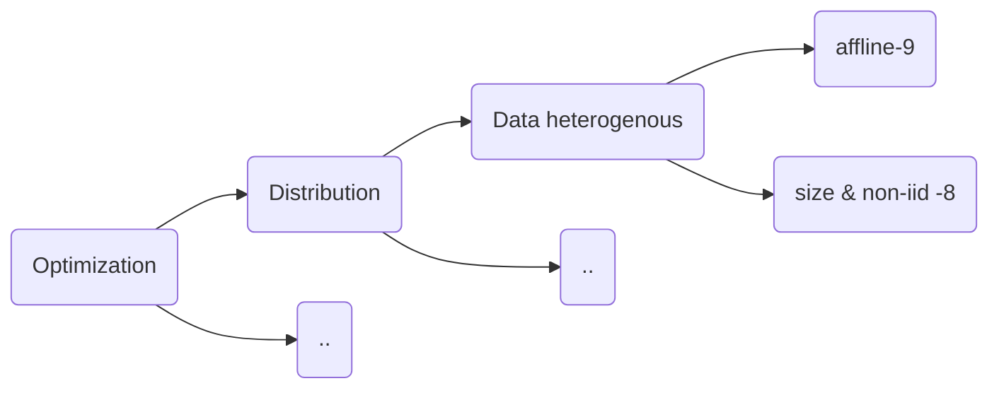

[A8] [Self-Balancing Federated Learning With Global Imbalanced Data in Mobile Systems](./Optimization_Distribution/A8-Self-Balancing-Federated-Learning-With-Global-Imbalanced-Data-in-Mobile-Systems.pdf)

The Astraea framework counterweighs the training of FL with imbalanced datasets by two strategies. First, before training the model, Astraea performs data augmentation to alleviate global imbalance. Second, Astraea proposes to use some mediators to reschedule the training of clients according to the KLD between the mediators and the uniform distribution.

[A9]
[robust-federated-learning-the-case-of-affine-distribution-shifts-Paper](./Optimization_Distribution/A9-robust-federated-learning-the-case-of-affine-distribution-shifts-Paper.pdf)
NIPS

This paper achieves satisfactory performance against distribution shifts in users’ samples (considering a structured affine distribution shift). To address this problem, they propose FLRA framework with a fast and efficient optimization method and provide convergence and performance guarantees via a gradient Descent Ascent (GDA) method. They further prove generalization error bounds for the learnt classifier to show proper generalization from empirical distribution of samples to the true underlying distribution.

[ST1] [Client Selection for Federated Learning with
Heterogeneous Resources in Mobile Edge](./Optimization_Distribution/St1_Client_Selection_for_Federated_Learning_with_Heterogeneous_Resources_in_Mobile_Edge.pdf)

This paper propose a client selection strategy suitable for heterogeneous nodes in distributed systems. It gives a submission deadline in federated learning in order to reduce the impact of staggers. The deadline has been choosen by experience.

