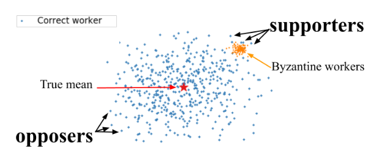
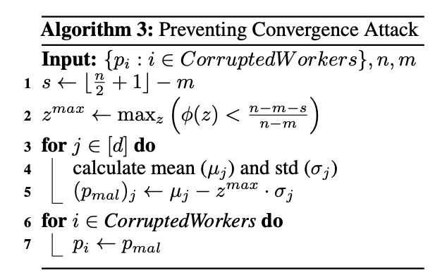
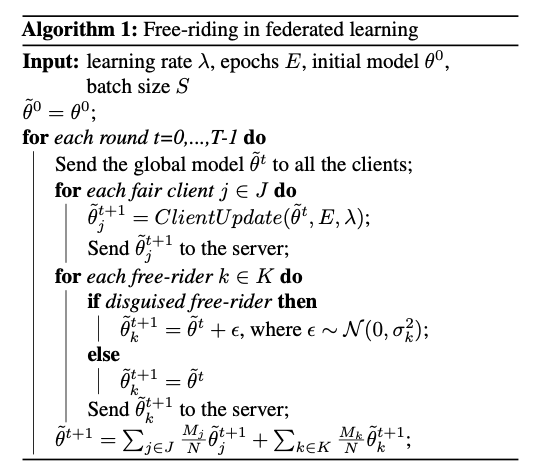
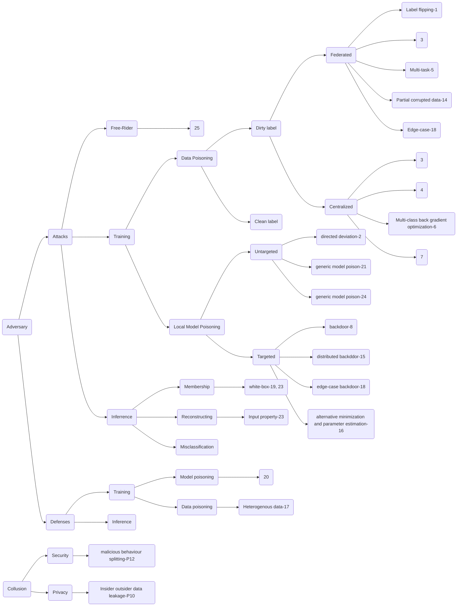

[P1] [Data Poisoning Attacks Against
Federated Learning Systems.](./Poison/P1_Data_Poisoning_Attacks_Against_Federated_Learning_Systems.pdf) ESORICS 19

This paper studies targeted data poisoning attacks against FL systems in which a malicious subset of the participants aim to poison the
global model by sending model updates derived from mislabeled data.

[P2] [Local Model Poisoning Attacks to Byzantine-Robust Federated Learning.](./Poison/P2_Local_Model_Poisoning_Attacks_to_Byzantine_Robust_Federated_Learning.pdf)Usenix Security 20


It performs the first systematic study on round-based local model poisoning attacks to federated learning under Byzantine-Robust FL. This paper formulates their attacks as optimization problems and apply our attacks to four recent Byzantine-robust federated learning methods.

```python
what = "model poisoning"
why = " first to consider about model poisoning under defenses"
goal = "untargeted model poisoning"
how = "directed deviation, to deviate a global model parameter most towards the inverse of the direction under aggregation defenses"
```


where s = 1 or -1


[P3] [Learning to Detect Malicious Clients for Robust Federated Learning.](./Poison/P3_Learning_to_Detect_Malicious_Clients_for_Robust_Federated_Learning.pdf)

As the central server in the system cannot govern the behaviors of the clients, a rogue client may initiate an attack by sending malicious model updates to the server, so as to degrade the learning performance or enforce targeted model poisoning attacks (a.k.a. backdoor attacks). Therefore, timely detecting these malicious model updates and the underlying attackers becomes critically important. This work proposes a new framework for robust federated learning where the central server learns to detect and remove the malicious model updates using a powerful detection model, leading to targeted defense. 


[P4] [Targeted Backdoor Attacks on Deep Learning Systems Using Data Poisoning.](./Poison/P4_Targeted_Backdoor_Attacks_on_Deep_Learning_Systems_Using_Data_Poisoning.pdf)

It focus on backdoor data poisoning. In this paper, their studied poisoning strategies can apply under a very weak threat model: (1) the adversary has no knowledge of the model and the training set used by the victim system; (2) the attacker is allowed to inject only a small amount of poisoning samples; (3) the backdoor key is hard to notice even by human beings to achieve stealthiness. 

[P5] [Data Poisoning Attacks on Federated Machine
Learning.](./Poison/P5_Data_Poisoning_Attacks_on_Federated_Machine_Learning.pdf)

This paper focus on attacking a federated multi-task learning framework. They formulate the problem of computing optimal poisoning attacks on federated multi-task learning as a bilevel program that is adaptive to arbitrary choice of target nodes and source attacking nodes. Then it propose a systems-aware optimization method, ATTack, which is efficiency to derive the implicit gradients for poisoned data, and further compute optimal attack strategies in the federated machine learning. 

[P6] [Towards Poisoning of Deep Learning Algorithms with
Back-gradient Optimization.](./Poison/P6_Towards_Poisoning_of_Deep_Learning_Algorithms_with_Back-gradient_Optimization.pdf)

To date, data poisoning attacks have been devised only against a limited class of binary learning algorithms, due to the inherent complexity of the gradient-based procedure used to optimize the poisoning points (a.k.a. adversarial training examples). This work extend the definition of poisoning attacks to multiclass problems and propose a poisoning algorithm based on the idea of back-gradient optimization, i.e., to compute the gradient of interest through automatic differentiation, while also reversing the learning procedure to drastically reduce the attack complexity.

[P7] [A Flexible Poisoning Attack Against Machine
Learning.](./Poison/P7_A_Flexible_Poisoning_Attack_Against_Machine_Learning.pdf) ICC 19

This article proposes an attack method in which the attacker makes the parameter value of the learning model close to his expected value and at the same time makes the model output wrong predictions for certain test samples. It considers the effect of attack and the concealment of attack. 


[P8] [How To Backdoor Federated Learning](./Poison/P8_How_To_Backdoor_Federated_Learning.pdf) AISTATS 20


The paper proposes an input matrix manipulation to conduct targeted local model poisoning backdoor in federated learning. When the global is about to converge, the attacker could inject a malicious model based on the difference of the clean global one. And it proved to be efficient even when the attacker does not know the global learning rate. 

[P9] [Understanding Distributed Poisoning Attack in Federated Learning](./Poison/P9_Understanding_Distributed_Poisoning_Attack_in_Federated Learning.pdf) ICPADS 19

[P10][Insider Collusion Attack on Privacy-Preserving
Kernel-Based Data Mining Systems](./Poison/P10-Insider-Collusion-Attack-on-Privacy-Preserving-Kernel-Based-Data-Mining-Systems.pdf) IEEE ACCESS 16

The scenarios are in distributed kernel-based data mining (DKBDM), such as distributed support vector machine. This paper address an attack of insiders (within an organization) colluding with outsiders an insider shares data with an outsider, who can then recover the original data from message transmissions (intermediary kernel values) among organizations using few data.

[P11] [Backdoor Attacks on Federated Meta-Learning](./Poison/P11_Backdoor_Attacks_on_Federated_Meta-Learning.pdf)

Contributions: 1. evaluated the trigger based data poisoning backdoor under Reptile meta-learning algorithm. 2. proposed a sanitizing fine-tuning defense process inspired by matching networks, where the class of an input is predicted from the cosine similarity of its weighted features with a support set of examples for each class. 

[P12] [Malware Collusion Attack against SVM:
Issues and Countermeasures](./Poison/P12-Malware-Collusion-Attack-against-SVM-Issues-and-Countermeasures.pdf) ICCCS 18

(Collusion and Evasion) Initially, the SVM based detection method, as well as other machine learning methods, performs a static analysis on Android Apps to construct a feature space and train a detection classifier using the features. Thus, this paper designs a collusion attack by splitting the nalicious feature into multiple apps. Apart from splitting the app into two or more apps, malware developers also have the incentive to add benign functions to hide its malicious behavior such as obfuscation, reflection, and class encryption.


[P14] [Robust Federated Training via Collaborative Machine Teaching using Trusted Instances](./Poison/P14_Robust_Federated_Training_via_Collaborative_Machine_Teaching_using_Trusted_Instances.pdf)
AAAI 20

This paper considers partial corrupted local data while the rest fraction is trusted in FL. The clients are organized to jointly tune the corrupted training data set, such that the model learnt with the tuned training set by the server predicts consistent targets as the trusted instances. More specifically, it adopt two types of training data tuning operations: crafting the training instances and subset-selecting the training set.


[P15]
[dba distributed backdoor attacks against federated learning](./Poison/P15_dba_distributed_backdoor_attacks_against_federated_learning.pdf)
ICLR 20

```python
why, what, goal = "[P8]"
how = "use distributed trigger rather than one trigger to achieve better occultation"
```


Instead of applying the same trigger in the attackers' datasets in [P8], this paper studies the distributed triggers (multiple triggers for subtasks) in FL, which can be more insidious and hard to detect. Additionally, the impact of triggers factors (eg. size, gap, location) are studied.

[P16]
[Analyzing Federated Learning through a Adversarial Lens](./Poison/P16_Analyzing_Federated_Learning_through_an_Adversarial_Lens.pdf)
ICML 19

1. FedAvg, boost the malicious agent’s update to overcome the effects of other agents’ updates by K times with E=5;
2. propose an alternating minimization strategy, which alternately optimizes for the stealth objectives and the adversarial objective; 
3. using parameter estimation for the benign agents’ updates to improve on attack success by averaging methods assuming the cumulative updates were the same at each step for benigns;  
4. use a suite of interpretability techniques to generate visual explanations for both benign and malicious models to demonstrate indistinguishability.

```python
what = "model poisoning by a single, non-colluding malicious agent"
why = " first to consider about stealth in model poisoning"
goal = "targeted, effective, stealth under defenses"
how = "effective = boosting of updates, stealth = alternating minimization strategy"
conclusion = "model poisoning attacks are much more effective than data poisoning in FL"
```

[P17]

[P18]
[attack-of-the-tails-yes-you-really-can-backdoor-federated-learning](./Poison/P18-attack-of-the-tails-yes-you-really-can-backdoor-federated-learning-Paper.pdf)
NIPS 20


```python
what = "edge-case backdoor: misclassify of easy inputs that are however unlikely to be part of the training, or test data, i.e., they live on the tail of the input distribution"
why = "hard to to filter under diverse data settings"
goal = "targeted under defense"
how = """
black-box: direct data poison;
PGD: periodically project their model on a small ball, centered around the global model of the previous round;
PGD+boosting[P16];
"""
```

This paper concludes that FL systems can NOT be tailored to be robust against backdoors. And it provides edge-case backdoors which forces a model to misclassify on seemingly easy inputs that are however unlikely to be part of the training, or test data, i.e., they live on the tail of the input distribution. Specifically, it is 3 attacks: black-box, PGD and PGD+boosting[P16]


[P19]
[Comprehensive Privacy Analysis of Deep Learning: Passive and Active White-box Inference Attacks against Centralized and Federated Learning](./Poison/P19_Comprehensive-Privacy-Analysis-of-Deep-Learning-Passive-and-Active-White-box-Inference-Attacks-against-Centralized-and-Federated-Learning.pdf)
S&P 19

This paper proposes a white-box membership inference attacks, one observation from this paper is that latter layer leaks more information than the former, however the leakage of activation layer is similar to output layer. So the results of white-box and black-box using activation information are similar. It design deep learning attack models using the gradient vector over all parameters on the target data point as the main feature for the attack. The architecture (simple CNN + FCN) processes extracted (gradient) features from different layers of the target model separately, and combines their information to compute the membership probability of a target data point. Further, it designs an active attack in the federated learning setting, the adversary can actively push SGD to leak even more information about the participants’ data. 


```python
what = "passive and active, white-box, inference, membership, central and FL"
goal = "white-box membership inference attacks"
why = "the leakage of activation layer is similar to output layer"
how = "train a binary classification model using gradients, hidden layers, output, loss"
```


[P20] [FLTrust: Byzantine-robust Federated Learning via Trust Bootstrapping
](./Poison/P20-FLTrust-Byzantine-robust-Federated-Learning-via-Trust-Bootstrapping.pdf)
NDSS 21

Rather than performing anomaly detection in local model, this paper build bootstraping trust by compute the cosine similarity beteween server updates and clients' updates, which is named as trust score. The weighted aggregation is based on trust scores and updates normalized by the magnitude of server updates.

[P21] [Manipulating the Byzantine: Optimizing Model Poisoning Attacks and Defenses for Federated Learning
](./Poison/P21-Manipulating-the-Byzantine-Optimizing-Model-Poisoning-Attacks-and-Defenses-for-Federated-Learning.pdf)
NDSS 21

```python
what = "model poisoning + defense"
goal = "untargeted under defense"
why = "defenses exist"
how = """
poisoning: introduce perturbation vectors and optimize the scaling factor 
defense: singular value decomposition based spectral methods
"""

This paper presents a generic framework for model poisoning attacks and a novel defense   called divide-and-conquer (DnC) on FL. The key idea of its generic poisoning is that they introduce perturbation vectors and optimize the scaling factor $\gamma$ in both AGR-tailored and AGR-agnostic manners. DnC applies a singular value decomposition (SVD) based spectral methods to detect and remove outliers.


```


[P22] [Threats to Federated Learning: A Survey](./Poison/P22_Threats-to-Federated-Learning-A-Survey.pdf)

It summarizes the existing threats to FL

[P23] [Exploiting Unintended Feature Leakage in Collaborative Learning](./poison/P23-Exploiting-Unintended-Feature-Leakage-in-Collaborative-Learning.pdf) S&P 19

It proposes a white box membership inference attack and property attack. For membership, the paper shows that it will be leaked by the embedding layer (e.g, one-hot word embedding) and the gradients. For the passive property attack (holding labeled property data), it trains a binary batch property classifier (LR, RF, etc.) using gradients with and with our property data. For the active property attack, muti-task learning is introduced. Specifically, it uses a joint loss on the main task and the property task. All of the attackers in this paper are honest.

[P24] [A Little Is Enough: Circumventing Defenses For Distributed Learning](./poison/P24-a-little-is-enough-circumventing-defenses-for-distributed-learning-Paper.pdf) NIPS 19

```python
what = "model poisoning"
goal = "untargeted/targeted under defense"
why = "variance between different workers is high enough"
how = "add a small amounts of noises to a benign aggregate."
```

This paper argues that variance between different workers is high enough so they provide a perturbation range in which the attacker can change the parameters without being detected even in i.i.d. settings. Changes within this range are sufficient for both interfering untargeted and targeted attack.



[P25] [Free-rider Attacks on Model Aggregation in Federated Learning](./poison/P25-Free-rider-Attacks-on-Model-Aggregation-in-Federated-Learning.pdf) AISTATS  21

```python
what = goal = "free-rider attack"
why = "get global for nothing without being detected"
how = "introduce a opportune stochastic perturbations of the parameters"
```

How to get \epsinon? a suitable time-varying perturbation * Gussian noise(In the paper, they use constant rather than time-varying).

Instead of send the global model last round back to the server, free-riders in this paper introduce a opportune stochastic perturbations of the parameters. As a result, the convergence of global model can be theoratically guaranteed and the free-riders can be hardly detected.

[P26] [Curse or Redemption? How Data Heterogeneity Affects
the Robustness of Federated Learning](./Poison/P26-Curse-or-Redemption-How-Data-Heterogeneity-Affects-the-Robustness-of-Federated-Learning.pdf) AAAI 21

This paper discusses the impacts brought by data hererogeneity of targeted poisoning. In summary, there are 3 redemptions and 3 curses and it provides some possible directions of defendses under non-iid. 3 of redemptions includes: 

	- non-iid makes ASR lower;
	- malicious data distribution matters;
	- higher scale/quantity of malicious users do not always help. 
3 curses includes:

	- non-iid makes ASR sensitive to attack timing, which makes it easier to attack (later the better)
	- similarity based defenses lose in non-iid cases
	- attack can be designed stronger by making the malicious data distribution close to the overall data distribution with the help of distribution distance measures



